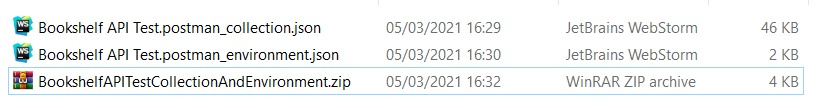
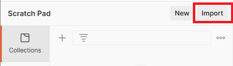
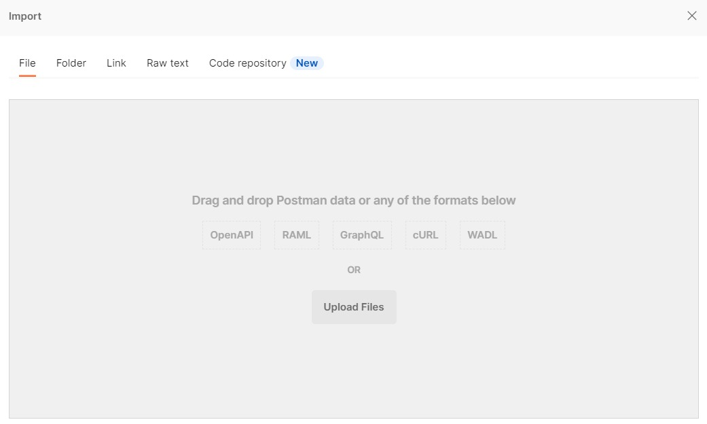
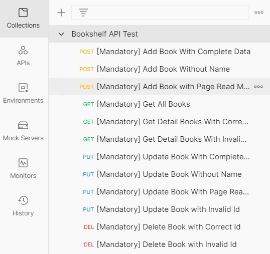

# Bookshelf API

Submission tugas proyek `Bookshelf API`.

## Standard API

### Sample API format

`{root.api}/{grouping}/{endpoint}`

SAMPLE: `http://localhost:5000/books/{bookId}`

### Standard Status Response

* 200 - OK                      --> Call API Success
* 201 - CREATED                 --> Post Success
* 400 - BAD REQUEST             --> Error on Client side
* 404 - NOT FOUND               --> Request Endpoint Not Found
* 500 - INTERNAL SERVER ERROR   --> Error on Server side

### GROUP: Book

#### [1] - Create a book

**API Endpoint**

Method: **POST**
URL: `{root.api}/books`

**req.body**
```json
{
    "name": string,
    "year": number,
    "author": string,
    "summary": string,
    "publisher": string,
    "pageCount": number,
    "readPage": number,
    "reading": boolean
}
```
**success-response**

- Status Code: 201
- Response Body:
  
```json
{
    "status": "success",
    "message": "Buku berhasil ditambahkan",
    "data": {
        "bookId": "1L7ZtDUFeGs7VlEt"
    }
}
```

**error-response**

Reason: `name` kosong
- Status Code: 400
- Response Body:
  
```json
{
    "status": "fail",
    "message": "Gagal menambahkan buku. Mohon isi nama buku"
}
```

Reason: `readPage` > `pageCount` kosong
- Status Code: 400
- Response Body:
  
```json
{
    "status": "fail",
    "message": "Gagal menambahkan buku. readPage tidak boleh lebih besar dari pageCount"
}
```
Reason: Server gagal memasukkan buku karena alasan umum (generic error)
- Status Code: 500
- Response Body:
  
```json
{
    "status": "error",
    "message": "Buku gagal ditambahkan"
}
```

#### [2] - Get all books

**API Endpoint**

Method: **GET**
URL: `{root.api}/books`

**success-response**

- Status Code: 200
- Response Body:
  
```json
{
    "status": "success",
    "data": {
        "books": [
            {
                "id": "Qbax5Oy7L8WKf74l",
                "name": "Buku A",
                "publisher": "Dicoding Indonesia"
            },
            {
                "id": "1L7ZtDUFeGs7VlEt",
                "name": "Buku B",
                "publisher": "Dicoding Indonesia"
            },
            {
                "id": "K8DZbfI-t3LrY7lD",
                "name": "Buku C",
                "publisher": "Dicoding Indonesia"
            }
        ]
    }
}
```

Jika belum terdapat buku yang dimasukkan, server bisa merespons dengan array books kosong.

```json
{
    "status": "success",
    "data": {
        "books": []
    }
}
```

#### [3] - Get a detail book

**API Endpoint**

Method: **GET**
URL: `{root.api}/books/{bookId}`

**success-response**

- Status Code: 200
- Response Body:
  
```json
{
    "status": "success",
    "data": {
        "book": {
            "id": "aWZBUW3JN_VBE-9I",
            "name": "Buku A Revisi",
            "year": 2011,
            "author": "Jane Doe",
            "summary": "Lorem Dolor sit Amet",
            "publisher": "Dicoding",
            "pageCount": 200,
            "readPage": 26,
            "finished": false,
            "reading": false,
            "insertedAt": "2021-03-05T06:14:28.930Z",
            "updatedAt": "2021-03-05T06:14:30.718Z"
        }
    }
}
```

**error-response**

Reason: Buku dengan `bookId` yang dilampirkan oleh client tidak ditemukan
- Status Code: 404
- Response Body:
  
```json
{
    "status": "fail",
    "message": "Buku tidak ditemukan"
}
```

#### [4] - Update a book

**API Endpoint**

Method: **PUT**
URL: `{root.api}/books/{bookId}`

**req.body**
```json
{
    "name": string,
    "year": number,
    "author": string,
    "summary": string,
    "publisher": string,
    "pageCount": number,
    "readPage": number,
    "reading": boolean
}
```
**success-response**

- Status Code: 200
- Response Body:
  
```json
{
    "status": "success",
    "message": "Buku berhasil diperbarui"
}
```

**error-response**

Reason: `name` kosong
- Status Code: 400
- Response Body:
  
```json
{
    "status": "fail",
    "message": "Gagal memperbarui buku. Mohon isi nama buku"
}
```

Reason: `readPage` > `pageCount` kosong
- Status Code: 400
- Response Body:
  
```json
{
    "status": "fail",
    "message": "Gagal memperbarui buku. readPage tidak boleh lebih besar dari pageCount"
}
```
Reason: `bookId` yang dilampirkan oleh client tidak ditemukkan oleh server.
- Status Code: 404
- Response Body:
  
```json
{
    "status": "fail",
    "message": "Gagal memperbarui buku. Id tidak ditemukan"
}
```

#### [5] - Delete a book

**API Endpoint**

Method: **DELETE**
URL: `{root.api}/books/{bookId}`

**success-response**

- Status Code: 200
- Response Body:
  
```json
{
    "status": "success",
    "message": "Buku berhasil dihapus"
}
```

**error-response**

Reason: Bila `bookId` yang dilampirkan tidak dimiliki oleh buku manapun
- Status Code: 404
- Response Body:
  
```json
{
    "status": "fail",
    "message": "Buku gagal dihapus. Id tidak ditemukan"
}
```

## Testing API

**Tools:**
- Aplikasi [Postman](https://www.postman.com/downloads)
- [Postman Bookshelf API Test Collection and Environment](https://github.com/dicodingacademy/a261-backend-pemula-labs/raw/099-shared-files/BookshelfAPITestCollectionAndEnvironment.zip)

Ekstrak file `zip` tersebut, seperti pada gambar:



Pada aplikasi **Postman**, klik tombol _import_ yang berada di atas panel kiri aplikasi, seperti pada gambar:



Kemudian, klik tombol _Upload Files_ untuk meng-_import_ kedua berkas JSON hasil ekstraksi, seperti pada gambar di bawah ini.



Setelah itu, Bookshelf API Test Collection and Environment akan tersedia pada Postman.



## Tambahan Fitur (untuk mendapatkan nilai tinggi)

- Tambahkan fitur query parameters pada route **GET /books** (Mendapatkan seluruh buku).
  - `?name` : Tampilkan seluruh buku yang mengandung nama berdasarkan nilai yang diberikan pada query ini. Contoh `/books?name=”dicoding”`, maka akan menampilkan daftar buku yang mengandung nama “dicoding” secara _non-case sensitive_ (tidak peduli besar dan kecil huruf).
  - `?reading` : Bernilai 0 atau 1. Bila 0, maka tampilkan buku yang sedang tidak dibaca (reading: false). Bila 1, maka tampilkan buku yang sedang dibaca (reading: true). Selain itu, tampilkan buku baik sedang dibaca atau tidak.
  - `?finished` : Bernilai 0 atau 1. Bila 0, maka tampilkan buku yang sudah belum selesai dibaca (finished: false). Bila 1, maka tampilkan buku yang sudah selesai dibaca (finished: true). Selain itu, tampilkan buku baik yang sudah selesai atau belum dibaca.
- Menerapkan **CORS** pada seluruh _resource_ yang ada.
- Menggunakan ESLint dan salah satu _style guide_ agar gaya penulisan kode JavaScript lebih konsisten.

## Berkas Submission

- Berkas harus dikirimkan dalam bentuk `zip`
- Terdapat berkas `package.json`
- Tidak mengikutkan/harus dihapus folder `node_modules`

## Syarat Submission `diterima`

- Semua kriteria wajib dari Bookshelf API terpenuhi
- Ketentuan berkas submission terpenuhi
- Versi nodejs minimal adalah versi LTS 14.17.0
- Bahasa Pemrograman yang digunakan harus JavaScript dan Node.js
- Harus menggunakan framework HapiJS Framework
- Tidak melakukan plagiarisme